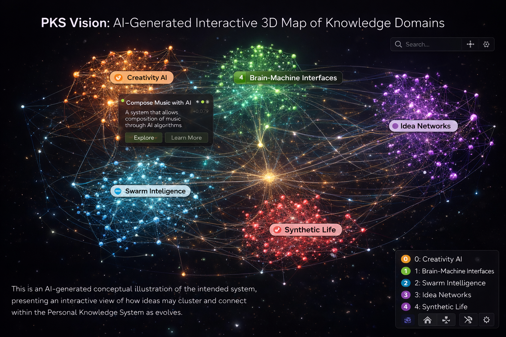
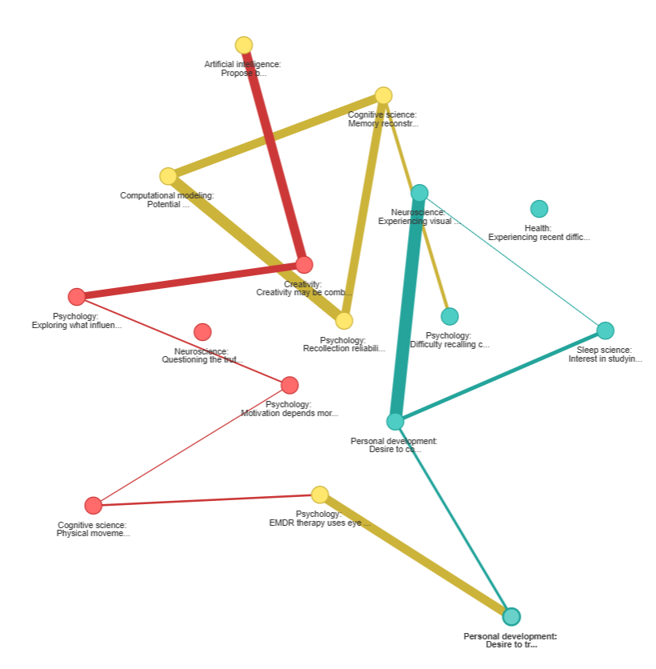

# Personal Knowledge System (PKS): A Prototype
_A prototype system for structuring and exploring ideas as a semantic graph_

**Offir Olivkovich**

---

This project implements a prototype Personal Knowledge System (PKS) that transforms unstructured streams of thought into a structured, queryable idea graph.

The system treats ideas as **atomic, structured units** that can be embedded, linked, and explored as part of a larger system.

<figure>
  
  <figcaption>AI-generated conceptual illustration of the system</figcaption>
</figure>

---

## Concept

Multi-domain thinkers often generate ideas across many areas, yet these ideas remain scattered, disconnected, and difficult to revisit.

When captured as text, thought is typically stored in a linear format. Even when structured by an LLM, the result remains shallow and difficult to navigate.

The core idea of this project is to treat ideas as **atomic, structured units** that can be embedded, linked, and explored as part of a larger system.

Instead of revisiting notes as documents, the system enables interaction with a **network of interconnected ideas**.

---

## Prototype Implementation

This repository contains a working prototype of the system.

Given a raw stream of thoughts, the system:

1. extracts atomic ideas using an LLM
2. enriches them with metadata
3. generates embeddings
4. stores them in a relational database
5. computes relationships between ideas

The result is a structured knowledge base that can be queried, explored, and analyzed.

This implementation focuses on demonstrating the core pipeline and interaction model, rather than building a full production system.

As such, some components (e.g., data persistence, orchestration, and interface) are simplified.

---

## Exploration Modes

### 1. Semantic Search

Retrieve ideas based on meaning rather than keywords.

* embedding-based similarity
* cross-domain discovery

---

### 2. Graph Navigation

Ideas are connected through:

* semantic similarity
* shared session context
* clustering

This enables navigation through ideas as a graph rather than linear notes.

<figure>
  
</figure>

---

## LLM-Based Exploration

After constructing the idea graph, the knowledge base can be explored through queries and exploratory data analysis (EDA). The following interaction layer introduces LLM-based exploration, enabling natural language interaction with the system.

The system exposes structured tools that operate over the knowledge base, while the LLM selects which tools to use and how to combine their outputs.

This design separates reasoning from data access, allowing the system to operate over structured representations rather than raw text.

---

## Key Features

* LLM-based idea extraction
* semantic search using embeddings
* relational database design
* graph-based idea linking
* clustering for global structure
* tool-based reasoning loop

---

## Tech Stack

* Python
* SQLite
* OpenAI API
* SentenceTransformers
* scikit-learn
* NetworkX / PyVis

---

## Running the Project

This repository contains a prototype notebook rather than a fully packaged application.

### Requirements

To run the project, you will need:

- Python environment with the required dependencies  
- a valid OpenAI API key  
- a local `data/` directory (already included, used for storing the database)  

---

### Setup

Install dependencies:

```bash
pip install -r requirements.txt
```

Set your OpenAI API key as an environment variable:

```bash
export OPENAI_API_KEY=your_api_key_here
```

(on Windows use setx OPENAI_API_KEY your_api_key_here)

### Running

- open the notebook (`pks_prototype.ipynb`) in Jupyter or VSCode  
- run the cells in order  

The system will create and populate the database inside the data/ directory automatically.

## Project Structure

```plaintext
├── data/                # generated locally (ignored)
├── images/
├── notebooks/
│   └── pks_prototype.ipynb
```

---

## Future Work

* dynamic graph updates across sessions
* improved idea categorization
* interactive UI
* local LLM support
* enhanced visualization

---

## Author

**Offir Olivkovich**
